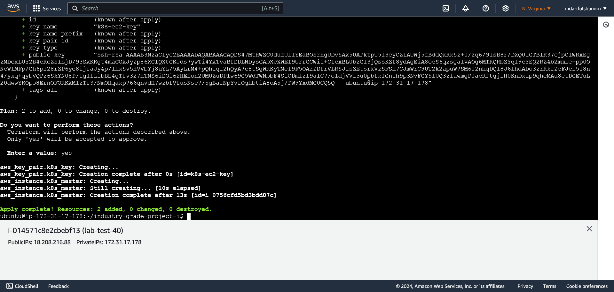

1. [README](README.md)
2. [CI/CD Pipeline Integration: Ansible Playbook for Kubernetes Resource Deployment](pipeline-integration.md)
3. Automating Kubernetes Cluster Deployment Using Terraform (main.tf, init/plan/apply)
4. [Kubernetes Observability: Installing Prometheus and Grafana Using Helm Charts](instruction-monitoring.md)

# Automating Kubernetes Cluster Deployment Using Terraform (main.tf, init/plan/apply)

Deploying a Kubernetes (K8s) cluster on AWS EC2 instances using Terraform involves several steps, from setting up your environment to applying your configuration. Below is a detailed hands-on example, including the necessary prerequisites, configuration, permissions, and the Terraform files required.

---

### Prerequisites

1. **AWS Account**: Ensure you have an AWS account and appropriate access credentials.

2. **IAM Role and Permissions**: Create an IAM user with `EC2`, `IAM`, `VPC`, and `EKS` permissions. Generate and download the Access Key ID and Secret Access Key.

3. **Tools Installation**: Install the following tools on your local machine or wherever you will execute Terraform:

    - **AWS CLI**: Configure AWS CLI with access keys.
    - **Terraform**: Install Terraform from [Terraform's official website](https://developer.hashicorp.com/terraform/downloads).
    - **kubectl**: Install `kubectl` to interact with the Kubernetes cluster.

4. **SSH Key Pair**: Generate an SSH key pair to access EC2 instances.

   ```bash
   ssh-keygen -t rsa -b 4096 -f ~/.ssh/id_rsa
   ```

---

### Step 1: Configure AWS CLI

1. **Run the AWS Configure Command**:
   ```bash
   aws configure
   ```

2. **Enter the Required Information**:
   The command will prompt you to enter four pieces of information:
    - **AWS Access Key ID**: Your access key ID.
    - **AWS Secret Access Key**: Your secret access key.
    - **Default Region Name**: The region you typically use (e.g., `us-east-1`).
    - **Default Output Format**: Optional; commonly `json`, `text`, or `table`.

   Example:
   ```plaintext
   AWS Access Key ID [None]: <Your Access Key ID>
   AWS Secret Access Key [None]: <Your Secret Access Key>
   Default region name [None]: us-east-1
   Default output format [None]: json
   ```

3. **Verify Configuration**:
   Run the following command to confirm the credentials are working:
   ```bash
   aws sts get-caller-identity
   ```

This command should return your account details, confirming that the credentials are correctly configured. If you don’t already have an access key and secret key, you can create them in the AWS Management Console under **IAM** > **Users** > *Your User* > **Security Credentials**.
---

### Step 2: Create `main.tf` Terraform Configuration File

This Terraform script will:

- Set up the required provider.
- Create a VPC and subnet for the cluster.
- Create an EC2 instance for the Kubernetes cluster control plane.
- Output necessary connection information.

Create a new directory for your project, and inside that directory, create a file named `main.tf`.

```hcl
# Provider configuration for AWS
provider "aws" {
  region = "us-east-1"  # Change to your preferred AWS region
}

# Configure SSH Key Pair for EC2 access
resource "aws_key_pair" "k8s_key" {
  key_name   = "k8s-ec2-key"
  public_key = file("~/.ssh/id_rsa.pub")  # Path to your public key
}

# VPC configuration
resource "aws_vpc" "k8s_vpc" {
  cidr_block = "10.0.0.0/16"
}

# Create an Internet Gateway for the VPC
resource "aws_internet_gateway" "k8s_igw" {
  vpc_id = aws_vpc.k8s_vpc.id
}

# Subnet configuration
resource "aws_subnet" "k8s_subnet" {
  vpc_id            = aws_vpc.k8s_vpc.id
  cidr_block        = "10.0.1.0/24"
  availability_zone = "us-east-1a"  # Change to your preferred AZ
}

# Security Group configuration
resource "aws_security_group" "k8s_sg" {
  vpc_id = aws_vpc.k8s_vpc.id

  ingress {
    from_port   = 22
    to_port     = 22
    protocol    = "tcp"
    cidr_blocks = ["0.0.0.0/0"]
  }

  ingress {
    from_port   = 6443
    to_port     = 6443
    protocol    = "tcp"
    cidr_blocks = ["0.0.0.0/0"]
  }

  egress {
    from_port   = 0
    to_port     = 0
    protocol    = "-1"
    cidr_blocks = ["0.0.0.0/0"]
  }
}

# EC2 instance configuration
resource "aws_instance" "k8s_master" {
  ami                    = "ami-0866a3c8686eaeeba" #"ami-0c55b159cbfafe1f0"  # Ubuntu 24.04 LTS AMI ID
  instance_type          = "t2.medium"  # Use a bigger instance type for production
  key_name               = aws_key_pair.k8s_key.key_name
  subnet_id              = aws_subnet.k8s_subnet.id
  vpc_security_group_ids = [aws_security_group.k8s_sg.id]
  associate_public_ip_address = true

  tags = {
    Name = "K8s-Master"
  }

  # Script to install Kubernetes on instance startup
  user_data = <<-EOF
    #!/bin/bash
    apt-get update
    apt-get install -y docker.io apt-transport-https ca-certificates curl

    # Kubernetes installation
    curl -s https://packages.cloud.google.com/apt/doc/apt-key.gpg | apt-key add -
    echo "deb https://apt.kubernetes.io/ kubernetes-xenial main" | tee -a /etc/apt/sources.list.d/kubernetes.list
    apt-get update
    apt-get install -y kubelet kubeadm kubectl
    kubeadm init --pod-network-cidr=10.244.0.0/16

    # Configure kubectl for root user
    export KUBECONFIG=/etc/kubernetes/admin.conf

    # Apply a network plugin (e.g., Flannel)
    kubectl apply -f https://raw.githubusercontent.com/coreos/flannel/master/Documentation/kube-flannel.yml
  EOF
}
```

---

### Step 3: Initialize Terraform

In your terminal, navigate to the directory containing `main.tf` and run:

```bash
terraform init
```

This will download and initialize the necessary provider plugins.

---

### Step 4: Review the Plan

Run the following command to see what resources will be created:

```bash
terraform plan
```

Verify the output to ensure it matches the resources you intend to create.

---

### Step 5: Apply the Configuration

Run the following command to create the resources defined in `main.tf`:

```bash
terraform apply
```

Type `yes` when prompted. This will deploy the VPC, subnet, security group, and EC2 instance for the Kubernetes control plane.

**Screenshot:** Add a screenshot showing terraform apply command execution.\


---

### Step 6: Configure kubectl

1. After Terraform completes, obtain the master node's IP from the output.
2. Connect to the EC2 instance:

   ```bash
   ssh -i ~/.ssh/id_rsa ubuntu@<k8s_master_public_ip>
   ```

3. Verify the Kubernetes cluster is operational:

   ```bash
   kubectl get nodes
   ```

---

### Step 7: (Optional) Configure Networking for the Cluster

Need to install a networking plugin. For example, using Calico:

```bash
kubectl apply -f https://docs.projectcalico.org/manifests/calico.yaml
```

---

### Step 8: Verify the Cluster

Run the following command to check that all nodes are in `Ready` state:

```bash
kubectl get nodes
```

---

### Step 9: Cleanup

To destroy the infrastructure, run:

```bash
terraform destroy
```

---
