1. [README](README.md)
2. CI/CD Pipeline Integration: Ansible Playbook for Kubernetes Resource Deployment
3. [Automating Kubernetes Cluster Deployment Using Terraform (main.tf, init/plan/apply)](instruction-terraform.md)
4. [Kubernetes Observability: Installing Prometheus and Grafana Using Helm Charts](instruction-monitoring.md)


# CI/CD Pipeline Integration: Ansible Playbook for Kubernetes Resource Deployment


#### CI/CD Pipeline for Retail Company on AWS EC2 with Jenkins, Docker, Ansible, Kubernetes, Prometheus, and Grafana

This guide provides a comprehensive setup for creating a CI/CD pipeline using various tools such as Jenkins, Docker, Ansible, Kubernetes, Prometheus, and Grafana, all deployed on an AWS EC2 Ubuntu 24.04 instance.

---

### Prerequisites:
- **AWS EC2 Ubuntu 24.04 instance**
- Access to **GitHub** and **DockerHub**
- Required tools: **Java**, **Maven**, **Git**, **Jenkins**, **Docker**, **Ansible**, **Kubernetes**, **Prometheus**, and **Grafana** pre-installed.

---
# **AWS EC2 Setup Guide**

This guide outlines the steps to set up an AWS EC2 instance with necessary tools for continuous integration and deployment using Jenkins, Docker, Ansible, Kubernetes, Prometheus, and Grafana.

## **1. Setup the AWS EC2 Instance**

### **1.1 Launch an EC2 Instance**
1. **Log in to your AWS account.**
2. **Navigate to the EC2 dashboard and launch a new instance:**
   - **Select the AMI:** Choose **Ubuntu Server 24.04 LTS**.
   - **Select an instance type:** Use `t2.micro` for testing.
   - **Configure security groups:** Allow the following ports:
      - **SSH (port 22)**
      - **HTTP (port 80)**
      - **HTTPS (port 443)**
      - **Jenkins (port 8080)**
      - **Docker (port 2376)**
      - **Grafana (port 3000)**
   - **Add an SSH key pair** for connecting to your instance.

   **Screenshot:** Add a screenshot of the EC2 instance configuration.

   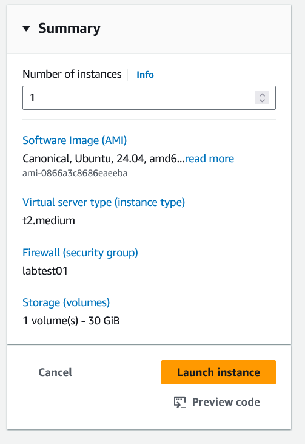


### **1.2 Connect to the Instance**
- **Open Terminal (Linux/Mac) or Putty (Windows).**
- **Navigate to the directory where your `.pem` file is saved.**
- **Connect using the following command (replace `<key-file>` and `<public-ip>`):**
   ```bash
   chmod 400 <key-file>.pem
   ssh -i <key-file>.pem ubuntu@<public-ip>
   ```

  **Screenshot:** Add a screenshot of the terminal connection process.
  

### **1.3 Update and Upgrade Packages**
```bash
sudo apt-get update && sudo apt-get install -y curl unzip git wget gnupg2 apt-transport-https ca-certificates gnupg lsb-release software-properties-common
```

---

## **2. Install Required Tools**

### **2.1 Install Java**
Jenkins requires Java to run.
```bash
sudo apt update
sudo apt install openjdk-17-jdk -y
java -version
```
**Screenshot:** Add a screenshot showing Java installation confirmation.\


### **2.2 Install Git**
```bash
sudo apt-get install git -y
git --version
```
**Screenshot:** Add a screenshot showing Git installation confirmation.\


### **2.3 Install Maven**
Maven is used to build Java projects.
```bash
sudo apt install maven -y
mvn -version
```
**Screenshot:** Add a screenshot showing Maven installation confirmation.\


### **2.4 Install Docker**
Docker will containerize the application.
```bash
sudo apt-get install docker.io -y
sudo systemctl start docker
sudo systemctl enable docker
sudo chmod 666 /var/run/docker.sock
docker --version
```
- **Add your user to the Docker group:**
```bash
#sudo groupadd docker
sudo usermod -aG docker $USER
```
- **Log out and re-login** for the group changes to take effect.

**Screenshot:** Add a screenshot showing Docker installation confirmation.\


### **2.5 Install Jenkins**
Jenkins automates builds and deployments.
```bash
# Add Jenkins key and repository
curl -fsSL https://pkg.jenkins.io/debian-stable/jenkins.io-2023.key | sudo tee /usr/share/keyrings/jenkins-keyring.asc > /dev/null
echo deb [signed-by=/usr/share/keyrings/jenkins-keyring.asc] https://pkg.jenkins.io/debian-stable binary/ | sudo tee /etc/apt/sources.list.d/jenkins.list > /dev/null

# Install Jenkins
sudo apt-get update
sudo apt-get install jenkins -y
sudo systemctl start jenkins
sudo systemctl enable jenkins
```
**Permissions and Jenkins Docker Setup:**
```bash
sudo usermod -aG docker jenkins
echo "jenkins ALL=(ALL) NOPASSWD: ALL" | sudo tee -a /etc/sudoers > /dev/null
```

- **Visit Jenkins** on `http://<EC2_PUBLIC_IP>:8080`
- **Get the initial password to unlock Jenkins:**
```bash
sudo cat /var/lib/jenkins/secrets/initialAdminPassword
```

**Screenshot:** Add a screenshot of Jenkins setup and initial password retrieval.\


### **2.6 Install Ansible**
Ansible will automate the deployment process.
```bash
sudo apt update && sudo apt upgrade -y
sudo apt install software-properties-common -y

# Add Ansible PPA and install Ansible
sudo add-apt-repository ppa:ansible/ansible -y
sudo apt update
sudo apt install ansible -y

# Create Ansible hosts file
mkdir ~/ansible
sudo tee ~/ansible/hosts > /dev/null <<EOL
[localhost]
localhost ansible_connection=local

[k8s]
localhost ansible_connection=local
EOL

# Create Ansible configuration file
sudo tee ~/ansible/ansible.cfg > /dev/null <<EOL
[defaults]
inventory = ./inventory

[privilege_escalation]
become = true
EOL

# Verify Ansible installation
ansible --version

# Install the community.docker collection
ansible-galaxy collection install community.docker kubernetes.core --force

# Install boto3 and botocore (Python libraries for AWS)
sudo apt-get update
sudo apt-get install build-essential libssl-dev libffi-dev python3-dev

sudo apt install python3-pip python3.12-venv -y

# Create a Virtual Environment
sudo -u ubuntu python3 -m venv /home/ubuntu/k8s-ansible-venv
source /home/ubuntu/k8s-ansible-venv/bin/activate

pip3 install boto3 botocore docker dockerpty kubernetes

pip show kubernetes
pip show docker
deactivate

```

**Screenshot:** Add a screenshot showing Ansible installation confirmation.


### **2.7 Add Remote Hosts to Inventory**
Edit the `~/ansible/hosts` file to include your remote servers:
```bash
[webservers]
remote-server-ip ansible_user=ubuntu ansible_ssh_private_key_file=~/.ssh/your-key.pem
```

### **2.8 Install Kubernetes Tools**
Install *kubectl* and *minikube*:
```bash
# Install kubectl
curl -LO "https://dl.k8s.io/release/$(curl -L -s https://dl.k8s.io/release/stable.txt)/bin/linux/amd64/kubectl"
chmod +x kubectl
sudo mv kubectl /usr/local/bin/

# Install minikube
curl -LO https://storage.googleapis.com/minikube/releases/latest/minikube-linux-amd64
chmod +x minikube-linux-amd64
sudo cp minikube-linux-amd64 /usr/local/bin/minikube

# Start minikube
minikube start

# Set permissions for Kubernetes config
chmod -R 777 /home/ubuntu/.kube/config 
chmod -R 777 /home/ubuntu/.minikube/ca.crt
chmod -R 777 /home/ubuntu/.minikube/profiles/minikube/client.crt
chmod -R 777 /home/ubuntu/.minikube/profiles/minikube/client.key

# Set environment path for Kubernetes config
export KUBECONFIG_PATH='/home/ubuntu/.kube/config'
```

**The Jenkins user, ensuring that Jenkins has the necessary permissions and access to the Kubernetes cluster**
```bash
# Set permissions for Kubernetes config
#sudo chown jenkins:jenkins ~/.kube/config
#sudo chmod 600 ~/.kube/config

#Create Kubernetes Directory for Jenkins
sudo mkdir -p /var/lib/jenkins/.kube
sudo cp /home/ubuntu/.kube/config /var/lib/jenkins/.kube/
sudo -u jenkins bash -c "echo 'export KUBECONFIG=var/lib/jenkins/.kube/config' >> ~/.bashrc"
sudo -u jenkins bash -c "source ~/.bashrc"
sudo chown -R jenkins:jenkins /var/lib/jenkins/.kube

# Create the Kubernetes configuration directory if it doesn't exist
sudo mkdir -p /var/lib/jenkins/.minikube/profiles/minikube
sudo cp -r /home/ubuntu/.minikube/profiles/minikube/* /var/lib/jenkins/.minikube/profiles/minikube/
sudo cp /home/ubuntu/.minikube/ca.crt /var/lib/jenkins/.minikube/
sudo chown -R jenkins:jenkins /var/lib/jenkins/.minikube

# Write the Kubernetes config to /var/lib/jenkins/.kube/config
# Use sed to update the specific lines in the config file
sudo sed -i "s|certificate-authority: .*|certificate-authority: /var/lib/jenkins/.minikube/ca.crt|" /var/lib/jenkins/.kube/config
sudo sed -i "s|client-certificate: .*|client-certificate: /var/lib/jenkins/.minikube/profiles/minikube/client.crt|" /var/lib/jenkins/.kube/config
sudo sed -i "s|client-key: .*|client-key: /var/lib/jenkins/.minikube/profiles/minikube/client.key|" /var/lib/jenkins/.kube/config

#Set the KUBECONFIG Environment Variable
#export KUBECONFIG=/home/ubuntu/.kube/config

#View Raw Kubernetes Configuration
#kubectl config view --raw > /tmp/kubeconfig

#Install CNI (Calico)
kubectl apply -f https://docs.projectcalico.org/manifests/calico.yaml

#check the cluster status
kubectl get nodes
```

**Check kubectl and minikube Version:**
```bash
$ kubectl version

Client Version: v1.31.1
Kustomize Version: v5.4.2
Server Version: v1.31.0

$ minikube version
minikube version: v1.34.0
commit: 210b148df93a80eb872ecbeb7e35281b3c582c61
```

---

### **3. Build a CI/CD Pipeline**

#### 3.1 Clone the GitHub Repository:
Clone the project repository to your EC2 instance:
```bash
git clone https://github.com/mah-shamim/industry-grade-project-ii.git
cd industry-grade-project-ii
```

#### 3.2 Create Jenkins Pipeline:
3.2.1. **Login to Jenkins** (`http://<EC2_PUBLIC_IP>:8080`).

3.2.2. Install required plugins:
   - Go to Manage Jenkins > Manage Plugins > Available. and search for
    - Docker Plugin
    - Docker Pipeline Plugin
    - Ansible Plugin
    - Kubernetes Plugin
    - SSH Agent Plugin
    - Restart Jenkins if prompted.
       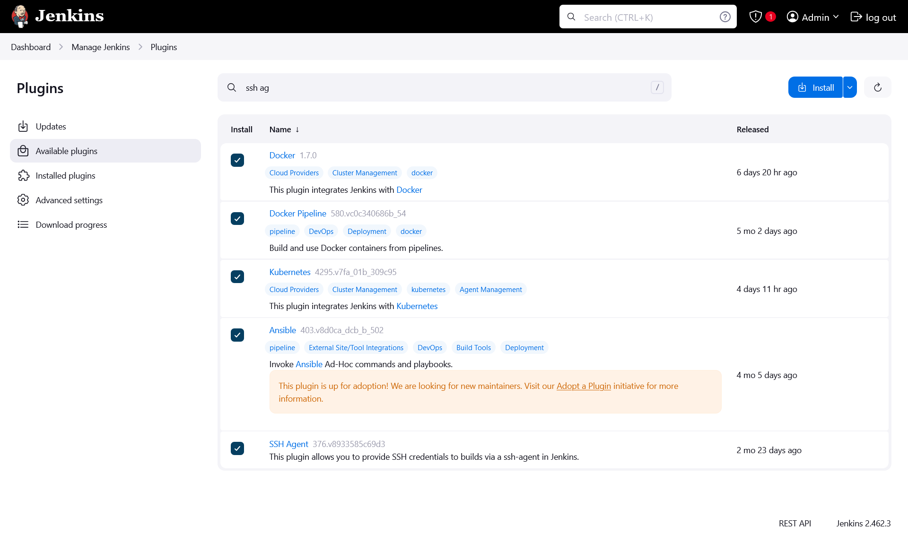
3.2.3. **Integrate GitHub with Jenkins**:
   - Add GitHub credentials:
     - Go to Jenkins Dashboard > Manage Jenkins > Manage Credentials.
     - Add a new set of credentials with:
         - Secret Text: Your GitHub Personal Access Key.
         - ID: Recognizable ID like `github`.\
           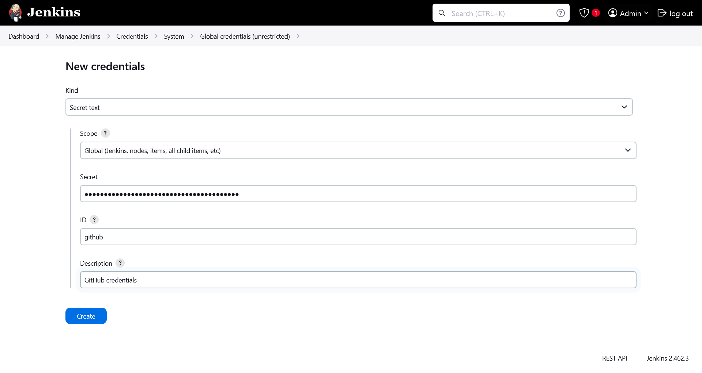

   - Create Docker Hub Credentials:
     - Go to Jenkins Dashboard > Manage Jenkins > Manage Credentials.
     - Add a new set of credentials with:
         - Username: Your Docker Hub username.
         - Password: Your Docker Hub password or access token.
         - ID: Recognizable ID like `dockerhub`.\
           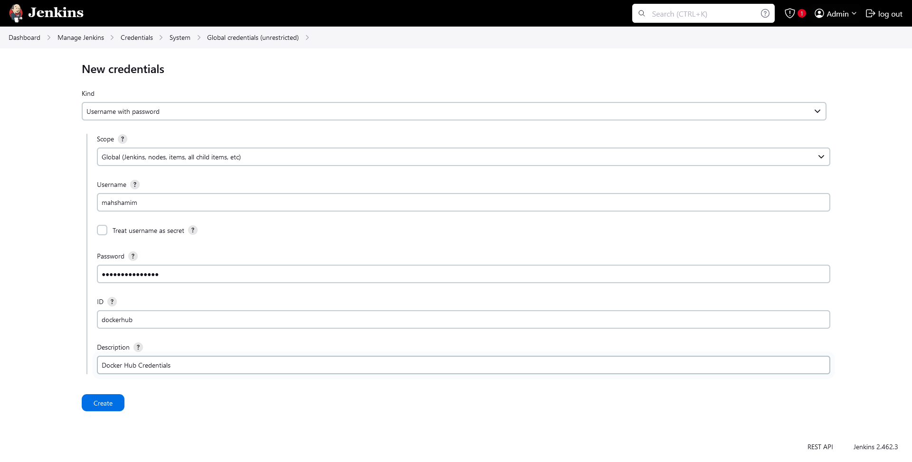

   - Create SSH Agent Credentials:
      - Go to Jenkins Dashboard > Manage Jenkins > Manage Credentials.
      - Add a new set of credentials with:
         - In the Kind dropdown, select "SSH Username with private key".
         - Username: Enter the SSH username that you use to access your Kubernetes master node (e.g., ubuntu, ec2-user, etc.).
         - Private Key: Select "Enter directly".
         - **Private Key Content**: Paste the content of your **private SSH key** (`.pem` or other SSH private key).
           - If you are using a `.pem` file for AWS EC2 instances, open the file in a text editor and copy its content.
           - For example, you can use the following command to view and copy the content of the key:

             ```bash
             cat /path/to/your-key.pem
             ```
         - **ID**: Recognizable ID like `authorized_keys`.
         - **Description**: (Optional) Add a description for the SSH key for easier identification.\
           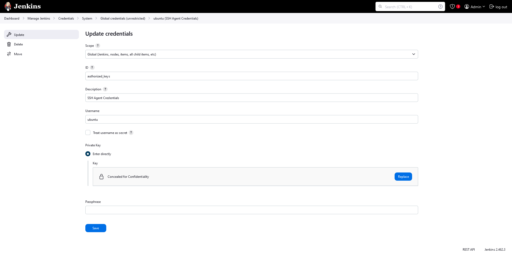

#### 3.3 Create a Freestyle Job for Each Task:
- **Compile Job**: Uses Maven to compile the code.
- **Test Job**: Runs tests.
- **Package Job**: Packages the code into a .war file.

#### 3.4 Dockerfile Example:
Example *Dockerfile* to deploy the .war to a Tomcat server:
```dockerfile
FROM iamdevopstrainer/tomcat:base
COPY target/XYZtechnologies-1.0.war /usr/local/tomcat/webapps/
CMD ["catalina.sh", "run"]
```

#### 3.5 Build and Push Docker Image:
```bash
docker build -t mahshamim/xyz-technologies:latest .
docker login
docker push mahshamim/xyz-technologies:latest
```

Configure Jenkins to build and push Docker images after packaging.

#### 3.6 Write Jenkinsfile:
To automatically deploy your project when you push code to Git (e.g., GitHub) using Jenkins, you need to set up a Jenkins pipeline with a Git webhook. Here's how you can achieve this:

### 3.6.1. **Set up Jenkins**

- **Install Jenkins**: If you haven't already, install Jenkins on your server.
- **Install Necessary Plugins**: Make sure the following plugins are installed:
    - Git Plugin (for integrating Git with Jenkins)
    - GitHub Integration Plugin (optional if using GitHub)
    - Pipeline Plugin (if you're using Jenkins pipelines)

### 3.6.2. **Create a New Jenkins Job (Freestyle or Pipeline)**

- **Freestyle Job**:
    1. Go to Jenkins dashboard > New Item.
    2. Select "Freestyle project" and provide a name for the job.
    3. Under **Source Code Management**, select **Git** and provide the repository URL (e.g., GitHub) and credentials.
    4. Under **Build Triggers**, select **GitHub hook trigger for GITScm polling** (if using GitHub) or configure a webhook in GitLab/Bitbucket for similar functionality.
    5. Add **Build Steps** (e.g., run a script to deploy your app, such as `docker-compose up`, `npm run build`, or any other deployment commands).
    6. Save and build.

       | GitHub Project url                                                  | GitHub hook trigger for GITScm polling                                                  |
       |-------------------------------------------------------------------|--------------------------------------------------------------------|
       | 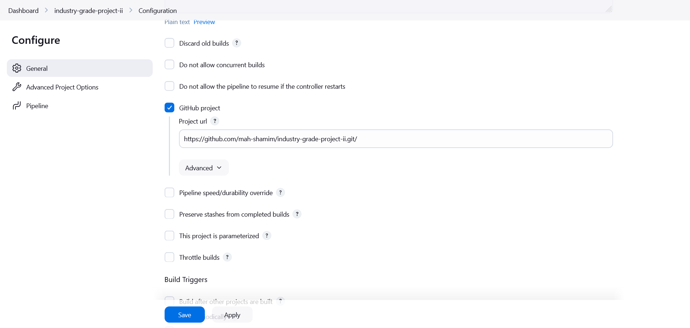 | 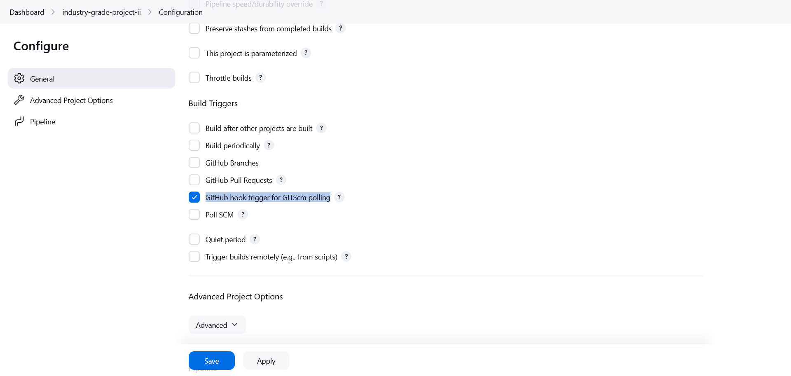 |

- **Pipeline Job**:
    1. Go to Jenkins dashboard > New Item.
    2. Select **Pipeline** and provide a name for the job.
    3. Under **Pipeline Definition**, you can either configure the pipeline directly in the **Pipeline Script** or use a `Jenkinsfile` stored in your repository.

Here’s a basic *Jenkinsfile* for CI/CD:
```groovy
pipeline {
    agent any
    environment {
        DOCKER_CREDENTIALS_ID = 'dockerhub' // Jenkins ID for DockerHub credentials
        DOCKER_IMAGE = 'mahshamim/xyz-technologies'
        DOCKER_REGISTRY = 'https://index.docker.io/v1/' // For DockerHub
        CONTAINER_NAME = "xyz-technologies"
        DOCKER_TAG = "${BUILD_ID}"  // Use the BUILD_ID as the tag
        CONTAINER_PORT = "9393"  // Use the BUILD_ID as the tag
    }
    stages {
        stage('Code Checkout') {
            steps {
                git branch: 'master', url: 'https://github.com/mah-shamim/industry-grade-project-ii.git'
            }
        }

        stage('Build') {
            steps {
                sh 'mvn clean compile'
            }
        }

        stage('Test') {
            steps {
                sh 'mvn test'
            }
        }

        stage('Package') {
            steps {
                sh 'mvn package'
            }
        }

        stage('Build Docker Image') {
            steps {
                script {
                    docker.build("${DOCKER_IMAGE}:${DOCKER_TAG}")
                }
            }
        }

        stage('Push to DockerHub') {
            steps {
                script {
                    docker.withRegistry("${DOCKER_REGISTRY}", "${DOCKER_CREDENTIALS_ID}") {
                        docker.image("${DOCKER_IMAGE}:${DOCKER_TAG}").push()
                    }
                }
            }
        }
        stage('Stopping and removing existing container...') {
            steps {
                script {
                    def containerExists = sh(
                        script: "docker inspect -f '{{.State.Running}}' ${CONTAINER_NAME}",
                        returnStatus: true
                    )
                    
                    if (containerExists == 0) {
                        echo "Container ${CONTAINER_NAME} exists. Stopping and removing..."
                        sh "docker stop ${CONTAINER_NAME} || true"
                        sh "docker rm ${CONTAINER_NAME}"
                    } else {
                        echo "Container ${CONTAINER_NAME} does not exist. No need to stop or remove."
                    }
                }
            }
        }
        stage('Deploy as container')
		{
			steps
			{
				sh 'docker run -d -p ${CONTAINER_PORT}:8080 --name $CONTAINER_NAME ${DOCKER_IMAGE}:${DOCKER_TAG} || { echo "Failed to start Docker container! Exiting."; exit 1; }'
			}
		}

    }
    post {
        always {
            cleanWs()
        }
    }
}
```
| Pipeline Status                                                  | Pipeline Console                                  | Pipeline Overview                                                  |
|------------------------------------------------------------------|-------------------------------------------------------------------|--------------------------------------------------------------------|
| 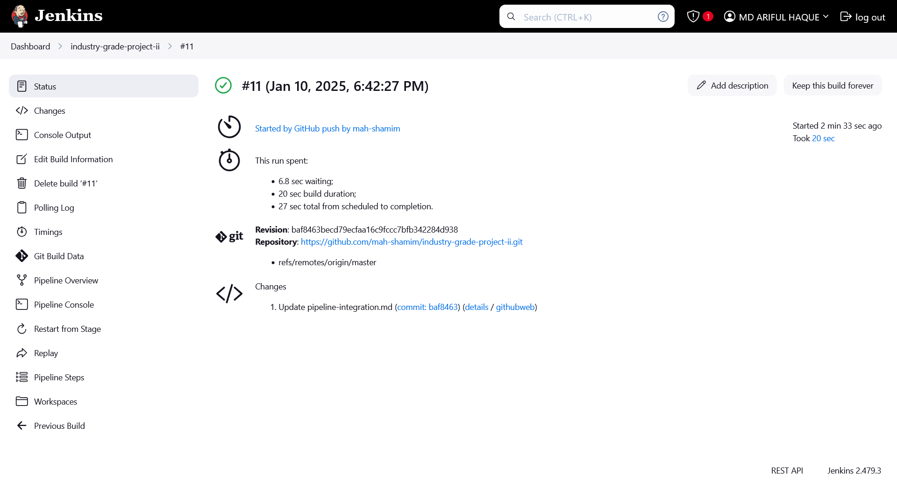  |  |  |

### 3.6.3. **Set Up Git Webhook**

- **GitHub**:
    1. Go to your GitHub repository > Settings > Webhooks.
    2. Click **Add webhook**.
    3. In the **Payload URL**, enter the Jenkins webhook URL. It usually looks like `http://your-jenkins-url/github-webhook/`.
    4. Set **Content type** to `application/json`.
    5. In **Which events would you like to trigger this webhook?**, select **Just the push event**.
    6. Save the webhook.

       | IMAGE                                           | IMAGE                                           |
       |-------------------------------------------------|-------------------------------------------------|
       | 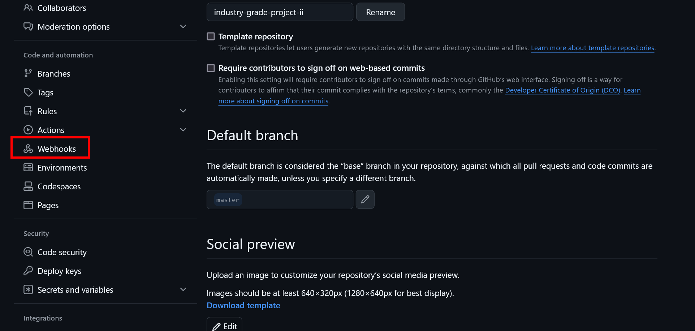 | 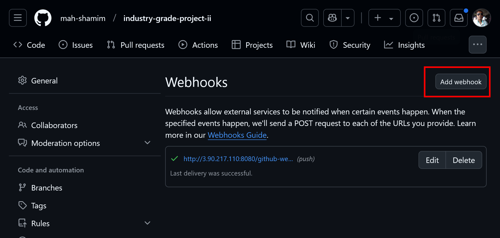 |
       | 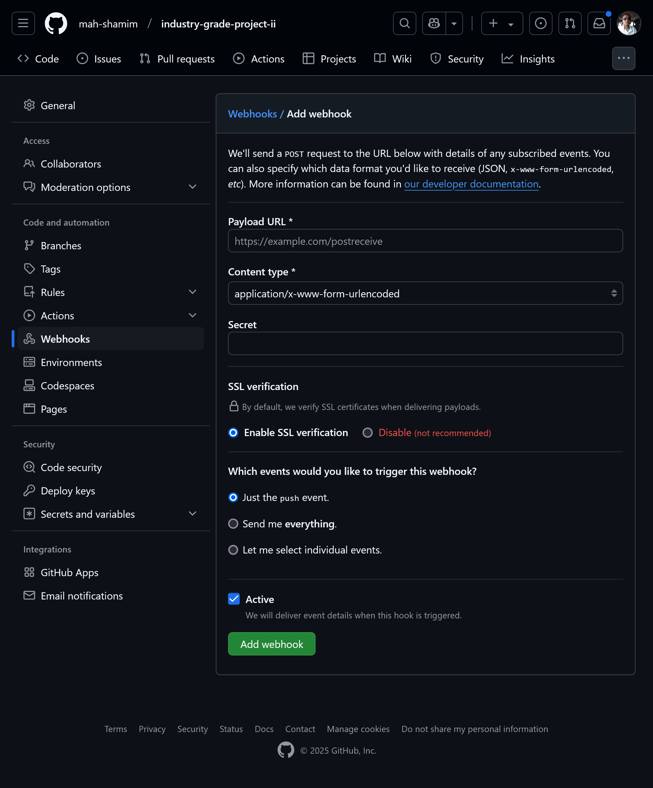 | 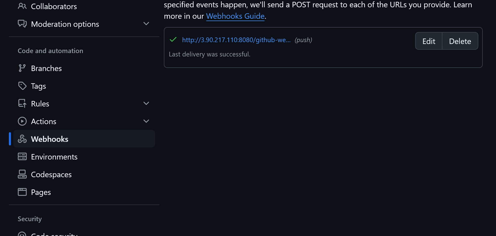 |


- **GitLab/Bitbucket**: Follow the similar steps to configure the webhook to point to your Jenkins server.

### 3.6.4. **Test the Automation**

- Push changes to your Git repository.
- The webhook should trigger Jenkins to start the job, and Jenkins should automatically deploy the application based on the defined steps in your pipeline.

This setup will ensure that Jenkins automatically triggers and deploys whenever a push is made to the repository.


#### 3.7 Configure Deployment Using Ansible:

Set environment variables: Before running your Ansible playbook, set your Docker Hub credentials as environment variables in your shell:
```bash
export DOCKER_USERNAME='' # your dockerhub username
export DOCKER_PASSWORD='' # your dockerhub password 

```

Ansible, Docker and Kubernetes Pipeline CI/CD
```groovy
pipeline {
    agent any
    environment {
        DOCKER_CREDENTIALS_ID = 'dockerhub'
        ANSIBLE_PLAYBOOK = 'playbook.yml' // Path to your Ansible playbook
        // Use the full path instead of ~
        KUBECONFIG = '/var/lib/jenkins/.kube/config'
    }
    stages {
        stage('Code Checkout') {
            steps {
                git branch: 'master', url: 'https://github.com/mah-shamim/industry-grade-project-ii.git'
            }
        }
        stage('Run Ansible Playbook') {
            steps {
                script {
                    // Use the withCredentials block to inject Docker Hub credentials
                    withCredentials([usernamePassword(credentialsId: DOCKER_CREDENTIALS_ID, passwordVariable: 'DOCKER_PASSWORD', usernameVariable: 'DOCKER_USERNAME')]) {
                        withEnv(['KUBECONFIG_PATH=/var/lib/jenkins/.kube/config']) {
                            sh 'ansible-playbook -i ~/ansible/inventory.ini playbook.yml --become'
                        }
                    }
                }
            }
        }
    }
    post {
        success {
            echo 'Ansible playbook executed successfully!'
        }
        failure {
            echo 'Ansible playbook execution failed.'
        }
    }
}
```
| Pipeline Status                                                                    | Pipeline Console                                                                 | Pipeline Overview                                                             |
|------------------------------------------------------------------------------------|----------------------------------------------------------------------------------|-------------------------------------------------------------------------------|
| 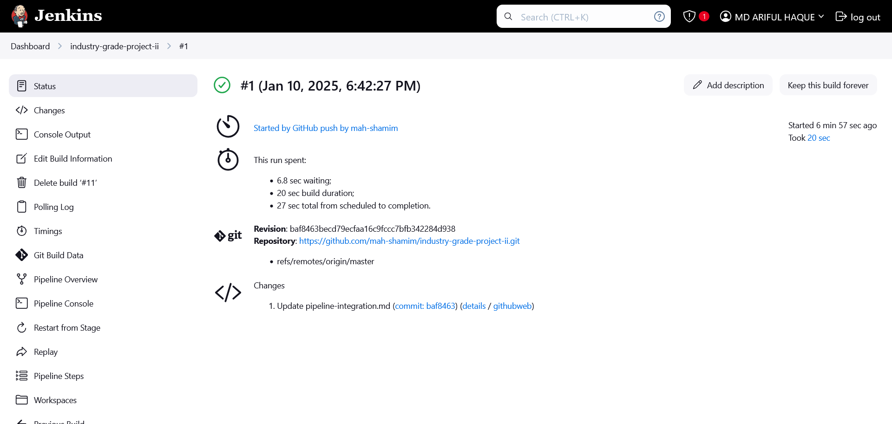 |   |  |


Create an Ansible playbook for deployment:
```yaml
- hosts: localhost
  become: yes
  become_method: sudo
  become_user: root
  vars:
     ansible_python_interpreter: /home/ubuntu/k8s-ansible-venv/bin/python
     docker_tag: "latest"  # Change this to any tag you want
     container_name: "xyz-technologies-ansible"
     image_name: "mahshamim/xyz-technologies-ansible"
     docker_username: "{{ lookup('env', 'DOCKER_USERNAME') }}"
     docker_password: "{{ lookup('env', 'DOCKER_PASSWORD') }}"
     kubeconfig_path: "{{ lookup('env', 'KUBECONFIG_PATH') }}"
     deployment_file: './k8s_deployments/deployment.yml'
     service_file: './k8s_deployments/service.yaml'
     namespace: "xyz--technologies-ansible" # Add your desired namespace here
     docker_host: "unix:///var/run/docker.sock"
  tasks:
     - name: Debug kubeconfig path
       debug:
          msg: "Kubeconfig path is {{ kubeconfig_path }}"

     - name: Log in to Docker Hub
       command: echo "{{ docker_password }}" | docker login -u "{{ docker_username }}" --password-stdin

     - name: Use Python from virtual environment
       ansible.builtin.command: /home/ubuntu/k8s-ansible-venv/bin/pip install kubernetes packaging

     - name: Check Python Kubernetes module
       ansible.builtin.command: /home/ubuntu/k8s-ansible-venv/bin/python -c "import kubernetes"

     - name: List installed packages
       ansible.builtin.command: /home/ubuntu/k8s-ansible-venv/bin/pip list

     - name: Check if Docker is already installed
       command: docker --version
       register: docker_installed
       ignore_errors: true

     - name: Install Docker
       apt:
          name: docker.io
          state: present
       when: docker_installed.rc != 0

     - name: Start Docker Service
       service:
          name: docker
          state: started
          enabled: true

     - name: Build WAR file using Maven (if applicable)
       command: mvn clean package
       args:
          chdir: ./
       when: docker_installed.rc == 0  # Run only if Docker is installed

     - name: Build Docker Image
       command: docker build -t {{ image_name }} .

     - name: Stop existing Docker container if running
       docker_container:
          name: "{{ container_name }}"
          state: absent
       ignore_errors: true

     - name: Remove existing Docker container if exists
       docker_container:
          name: "{{ container_name }}"
          state: absent
       ignore_errors: true

     - name: Run Docker Container
       docker_container:
          name: "{{ container_name }}"
          image: "{{ image_name }}"
          state: started
          published_ports:
             - "9393:8080"

     - name: Log in to Docker Hub
       docker_login:
          username: "{{ docker_username }}"
          password: "{{ docker_password }}"

     - name: Tag Docker image for Docker Hub
       command: docker tag {{ image_name }} "{{ image_name }}:{{ docker_tag }}"

     - name: Push Docker image to Docker Hub
       command: docker push "{{ image_name }}:{{ docker_tag }}"

     - name: Ensure Kubernetes namespace exists
       kubernetes.core.k8s:
          name: "{{ namespace }}"
          state: present
          kubeconfig: "{{ kubeconfig_path }}"
          api_version: v1
          kind: Namespace

     - name: Apply Kubernetes Deployment
       kubernetes.core.k8s:
          state: present
          kubeconfig: "{{ kubeconfig_path }}"
          definition: "{{ lookup('file', deployment_file) }}"
          namespace: "{{ namespace }}"  # Specify the namespace here

     - name: Apply Kubernetes Service
       kubernetes.core.k8s:
          state: present
          kubeconfig: "{{ kubeconfig_path }}"
          definition: "{{ lookup('file', service_file) }}"
          namespace: "{{ namespace }}"  # Specify the namespace here
```

**Test the Ansible Playbook:** Run the following command to execute the playbook:
```bash
ansible-playbook path/to/your/playbook.yml
```
OR
```bash
ansible-playbook -i inventory.ini path/to/your/playbook.yml --become
```

**Ansible Playbook Output**
| Jenkins Pipeline                                                                | Run Ansible Playbook                                                             |
|---------------------------------------------------------------------------------|-------------------------------------------------------------------------------|
| 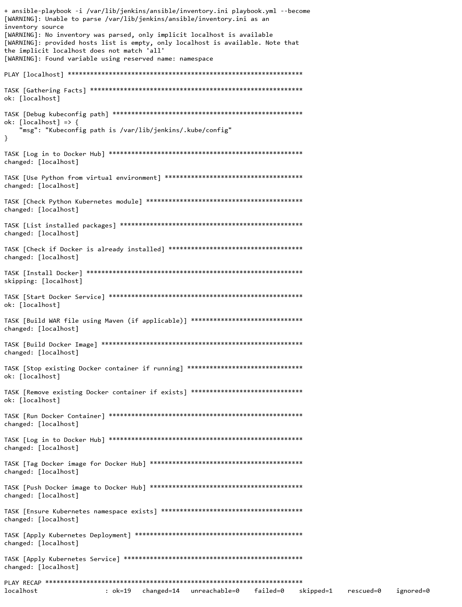 | 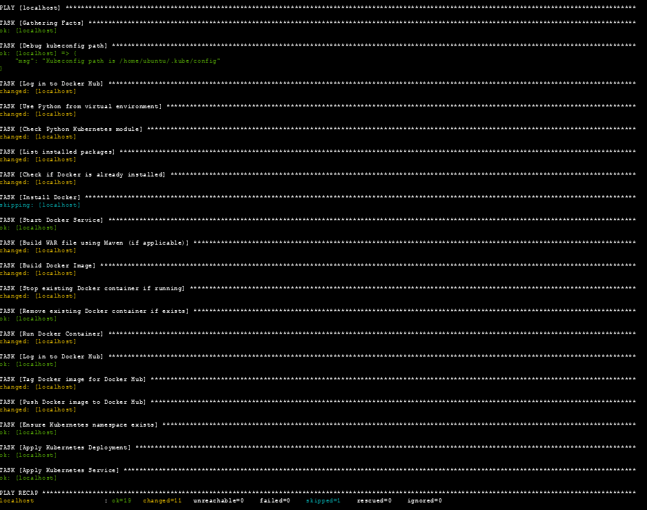 |


**Check Project**
```html
<domain or ip>:<port>/XYZtechnologies-1.0/
```
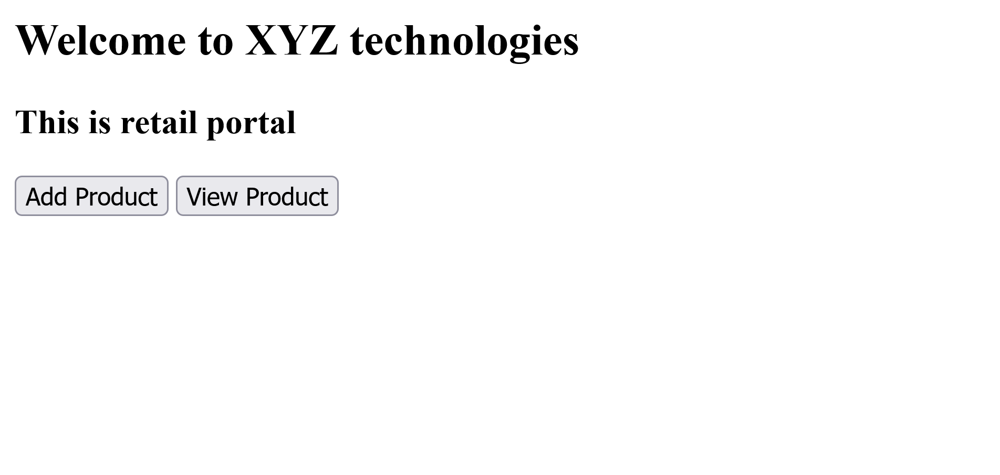


#### 3.8 Deploy Artifacts to Kubernetes
3.8.1. **Kubernetes Deployment Manifest**:
Create a file named `deployment.yml`:
```yaml
apiVersion: apps/v1
kind: Deployment
metadata:
  name: xyz-technologies-deployment
spec:
  replicas: 2
  selector:
    matchLabels:
      app: xyz-technologies
  template:
    metadata:
      labels:
        app: xyz-technologies
    spec:
      containers:
        - name: xyz-technologies
          image: mahshamim/xyz-technologies:latest
          ports:
            - containerPort: 8080
```

3.8.2. **Service Manifest**:
Create a file named `service.yaml`:
```yaml
apiVersion: v1
kind: Service
metadata:
  name: xyz-technologies-service
spec:
  type: NodePort
  ports:
    - port: 8080
      targetPort: 8080
      nodePort: 30000
  selector:
    app: xyz-technologies
```

3.8.3. **Deploy to Kubernetes**:
Run the following commands:
```bash
kubectl apply -f deployment.yml --validate=false
kubectl apply -f service.yaml --validate=false
```

### 3.8.4. *Enable Kubernetes Dashboard*
If you haven't already enabled the Kubernetes dashboard, you need to do so by running the following commands on your EC2 instance:

```bash
minikube addons enable dashboard
minikube addons enable metrics-server
```

### 3.8.5. *Access the Dashboard*
Start the Kubernetes dashboard using:

```bash
minikube dashboard --url
```

This command will start the dashboard and give you a URL to access it. However, the URL will only be accessible from the local environment (EC2 instance) by default.

### 3.8.6. *Port Forwarding to Access Dashboard Remotely*
Since you're using AWS EC2, to access the Kubernetes dashboard from your local machine (laptop or desktop), you need to set up port forwarding. You can use SSH tunneling for that.

From your local machine, run the following command (replace ec2-user with your actual EC2 username and your-ec2-public-ip with your EC2 instance’s public IP address):

```bash
ssh -i /path/to/your-key.pem -L 8001:127.0.0.1:8001 ec2-user@your-ec2-public-ip
```

This will forward traffic from your local port 8001 to the same port on the EC2 instance.

### 3.8.7. *Start the Proxy*
On your EC2 instance, start the kubectl proxy to forward API requests from the browser to the Kubernetes cluster:

```bash
kubectl proxy --port=8001
```

### 3.8.9. *Access the Dashboard from Your Browser*
Now, on your local machine, open the following URL in your web browser:

[Kubernetes dashboard](http://127.0.0.1:8001/api/v1/namespaces/kubernetes-dashboard/services/http:kubernetes-dashboard:/proxy/)


This should bring up the Kubernetes dashboard.

**Screenshot:** Add a screenshot of the Kubernetes dashboard.
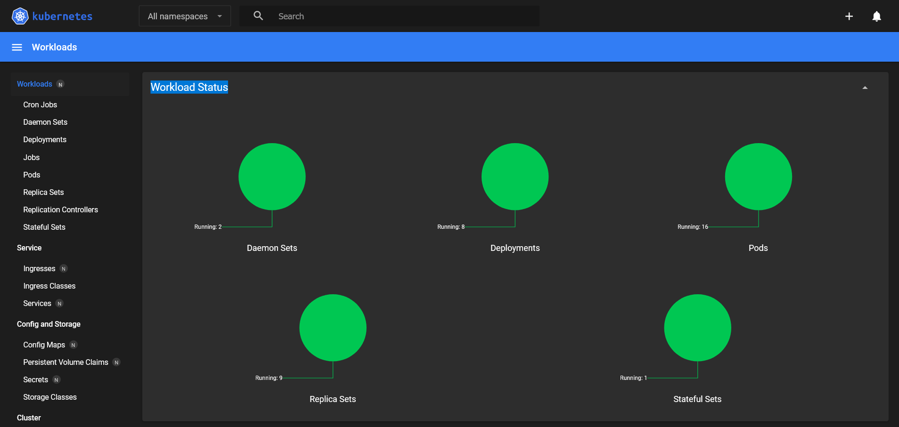

### 3.8.10. *Authentication*
The Kubernetes dashboard may ask for an authentication token. To get the token, you can use this command on the EC2 instance:

```bash
kubectl -n kubernetes-dashboard create token admin-user
```

Copy the token and use it for logging into the dashboard.

### 3.8.11. *Kubernetes cluster using an Ansible playbook*


### **4. Set Up Monitoring with Prometheus and Grafana**

#### Step 2: Install Helm
Helm is required to install and manage Prometheus and Grafana using Helm charts.

2.1. **Download and Install Helm:**
```bash
curl https://raw.githubusercontent.com/helm/helm/main/scripts/get-helm-3 | bash
```

2.2. **Verify Helm Installation:**
```bash
helm version
```

#### Step 3: Add Helm Repositories for Prometheus and Grafana
3.1. **Install CRI-Docker:**
```bash
sudo wget https://raw.githubusercontent.com/lerndevops/labs/master/scripts/installCRIDockerd.sh -P /tmp
sudo chmod 755 /tmp/installCRIDockerd.sh
sudo bash /tmp/installCRIDockerd.sh
sudo systemctl restart cri-docker.service
```

3.2. **Install kubeadm,kubelet,kubectl:**
```bash
sudo wget https://raw.githubusercontent.com/lerndevops/labs/master/scripts/installK8S.sh -P /tmp
sudo chmod 755 /tmp/installK8S.sh
sudo bash /tmp/installK8S.sh
```

3.3. **Add Prometheus Helm Chart Repository:**
```bash
helm repo add prometheus-community https://prometheus-community.github.io/helm-charts
```

3.4. **Add Grafana Helm Chart Repository:**
```bash
helm repo add grafana https://grafana.github.io/helm-charts
```

3.5. **Update Helm Repositories:**
```bash
helm repo update
```

#### Step 4: Deploy Prometheus
4.1. **Create a Kubernetes Namespace for Monitoring:**
```bash
kubectl create namespace monitoring
```

4.2. **Install Prometheus Using Helm:**
```bash
helm install prometheus prometheus-community/prometheus --namespace monitoring
```

4.3. **Verify Prometheus Installation:**
```bash
kubectl get pods -n monitoring
```

From your local machine, run the following command (replace ec2-user with your actual EC2 username and your-ec2-public-ip with your EC2 instance’s public IP address):

```bash
ssh -i /path/to/your-key.pem -L 9090:127.0.0.1:9090 ec2-user@your-ec2-public-ip
```

Once the Prometheus pods are running, you can access the Prometheus UI:

```bash
kubectl port-forward -n monitoring deploy/prometheus-server 9090:9090
```

Access it via your browser at `http://localhost:9090`.

**Screenshot:** Add a screenshot of the Prometheus dashboard.
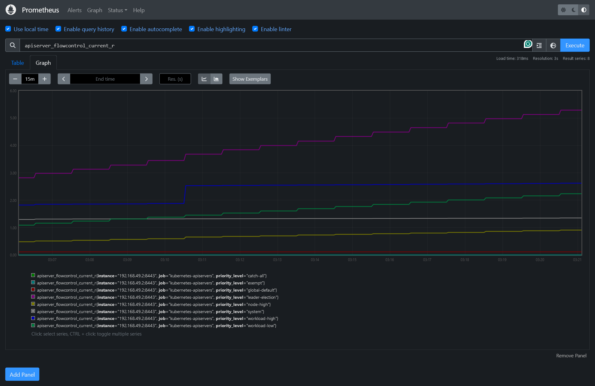

#### Step 5: Deploy Grafana
5.1. **Install Grafana Using Helm:**
```bash
helm install grafana grafana/grafana --namespace monitoring
```

5.2. **Check the Status of Grafana Pod:**
```bash
kubectl get pods -n monitoring
```

5.3. **Get Grafana Admin Password:**
```bash
kubectl get secret --namespace monitoring grafana -o jsonpath="{.data.admin-password}" | base64 --decode ; echo
```
From your local machine, run the following command (replace ec2-user with your actual EC2 username and your-ec2-public-ip with your EC2 instance’s public IP address):

```bash
ssh -i /path/to/your-key.pem -L 3000:127.0.0.1:3000 ec2-user@your-ec2-public-ip
```

5.4. **Access Grafana UI:**
Port-forward the Grafana service:
```bash
kubectl port-forward -n monitoring service/grafana 3000:80
```

Access Grafana UI in your browser: `http://localhost:3000`
- Username: `admin`
- Password: (retrieved from the previous step)

#### Step 6: Configure Prometheus as a Data Source in Grafana
Once you log in to Grafana, configure Prometheus as the data source:
1. Navigate to **Configuration > Data Sources**.
2. Add Prometheus as the data source.
3. Set the URL to `http://prometheus-server.monitoring.svc.cluster.local:9090`.
4. Save & Test the configuration.

#### Step 7: Access Prometheus and Grafana from AWS EC2
1. Expose the Prometheus and Grafana services using LoadBalancer or NodePort if you want to access them from your AWS EC2 public IP `http://<EC2_PUBLIC_IP>`.

For NodePort, modify the service type:
```bash
kubectl edit service grafana -n monitoring
```
Change `type: ClusterIP` to `type: NodePort` and save.

Check the NodePort assigned using:
```bash
kubectl get svc -n monitoring
```
Access Grafana using `http://<EC2_PUBLIC_IP>:<NodePort>`

You can do the same for Prometheus.
```
NAME                                                    READY   STATUS    RESTARTS   AGE
pod/grafana-7d69f48648-vjpwg                            1/1     Running   0          19m
pod/prometheus-alertmanager-0                           1/1     Running   0          21m
pod/prometheus-kube-state-metrics-7b97cb57c6-npvcj      1/1     Running   0          21m
pod/prometheus-prometheus-node-exporter-g2t7m           1/1     Running   0          21m
pod/prometheus-prometheus-pushgateway-9f8c968d6-dr4vk   1/1     Running   0          21m
pod/prometheus-server-6cbfc7ff77-dfzbb                  2/2     Running   0          6m25s

NAME                                          TYPE        CLUSTER-IP      EXTERNAL-IP   PORT(S)    AGE
service/grafana                               ClusterIP   10.106.12.39    <none>        80/TCP     19m
service/prometheus-alertmanager               ClusterIP   10.107.188.80   <none>        9093/TCP   21m
service/prometheus-alertmanager-headless      ClusterIP   None            <none>        9093/TCP   21m
service/prometheus-kube-state-metrics         ClusterIP   10.98.200.95    <none>        8080/TCP   21m
service/prometheus-prometheus-node-exporter   ClusterIP   10.105.75.66    <none>        9100/TCP   21m
service/prometheus-prometheus-pushgateway     ClusterIP   10.100.72.249   <none>        9091/TCP   21m
service/prometheus-server                     ClusterIP   10.97.70.199    <none>        80/TCP     21m

NAME                                                 DESIRED   CURRENT   READY   UP-TO-DATE   AVAILABLE   NODE SELECTOR            AGE
daemonset.apps/prometheus-prometheus-node-exporter   1         1         1       1            1           kubernetes.io/os=linux   21m

NAME                                                READY   UP-TO-DATE   AVAILABLE   AGE
deployment.apps/grafana                             1/1     1            1           19m
deployment.apps/prometheus-kube-state-metrics       1/1     1            1           21m
deployment.apps/prometheus-prometheus-pushgateway   1/1     1            1           21m
deployment.apps/prometheus-server                   1/1     1            1           21m

NAME                                                          DESIRED   CURRENT   READY   AGE
replicaset.apps/grafana-7d69f48648                            1         1         1       19m
replicaset.apps/prometheus-kube-state-metrics-7b97cb57c6      1         1         1       21m
replicaset.apps/prometheus-prometheus-pushgateway-9f8c968d6   1         1         1       21m
replicaset.apps/prometheus-server-6cbfc7ff77                  1         1         1       6m25s
replicaset.apps/prometheus-server-7d64c54f54                  0         0         0       21m

NAME                                       READY   AGE
statefulset.apps/prometheus-alertmanager   1/1     21m
```

#### Step 8: Set Up Kubernetes Cluster Permissions for Monitoring
Make sure Prometheus has access to scrape metrics from the Kubernetes cluster. Create a ClusterRole and RoleBinding:

```bash
kubectl apply -f https://raw.githubusercontent.com/prometheus-operator/prometheus-operator/main/example/rbac/prometheus/prometheus-cluster-role.yaml
```
**Screenshot:** Add a screenshot of the Grafana dashboard.
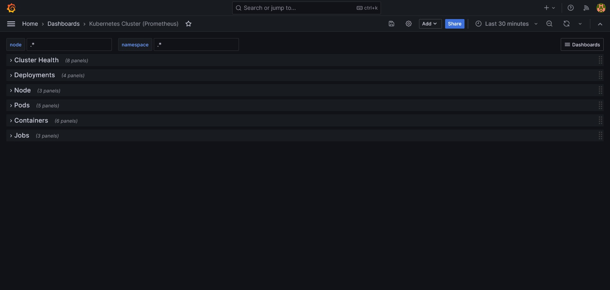
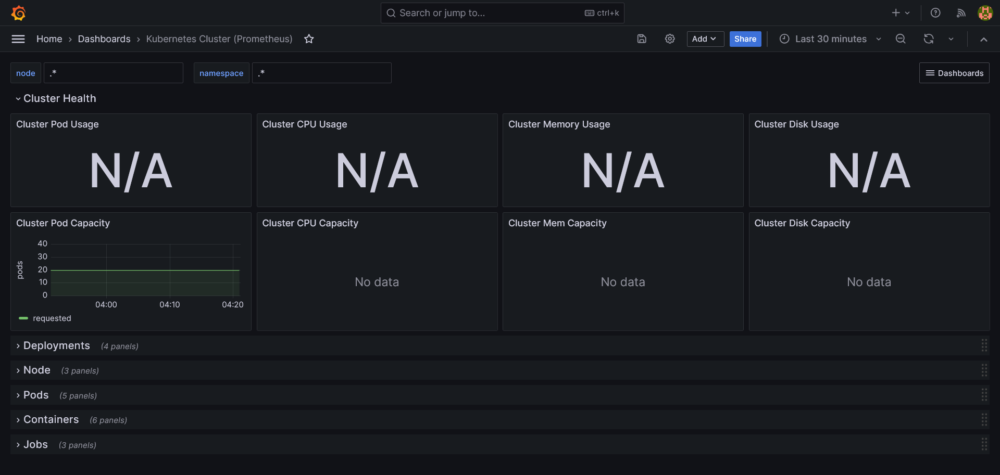
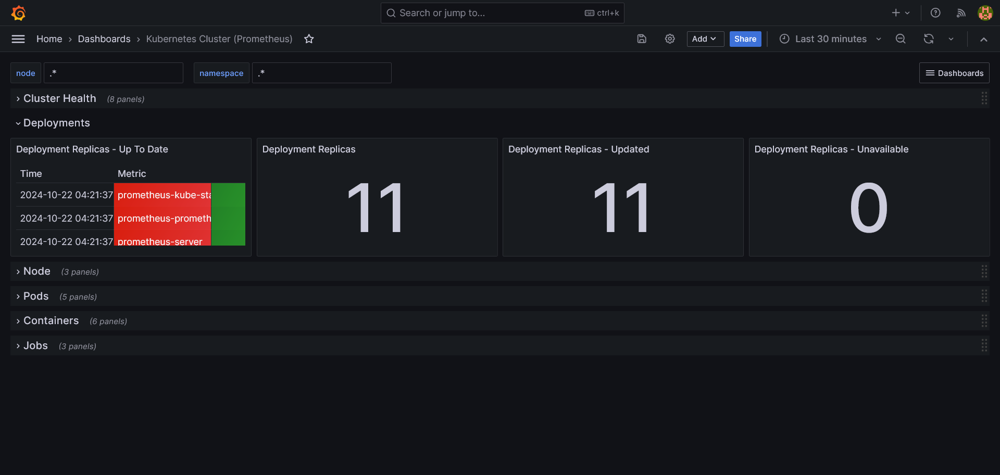
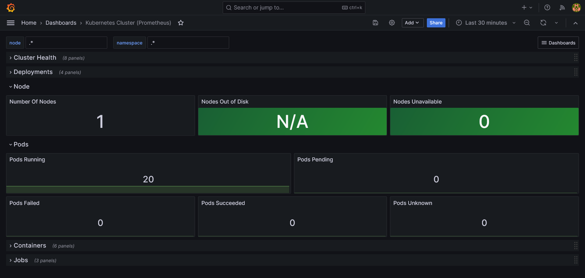
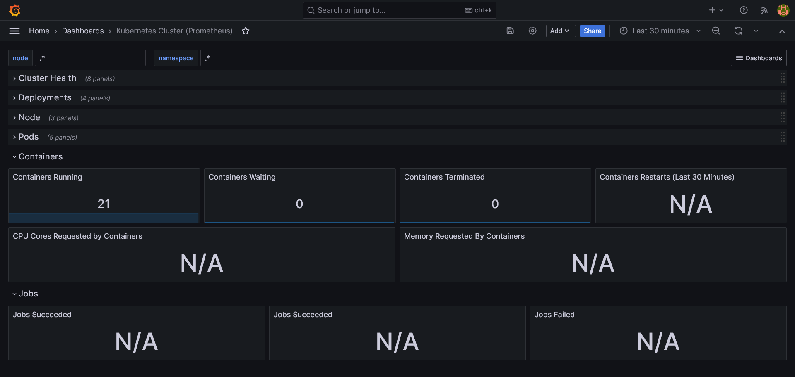
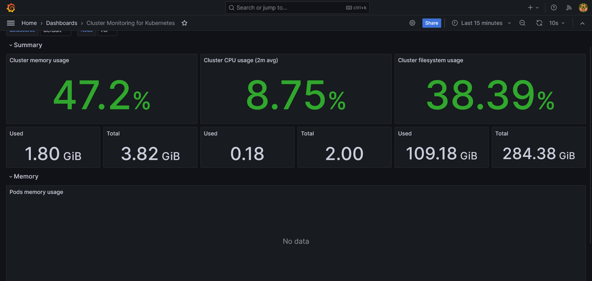
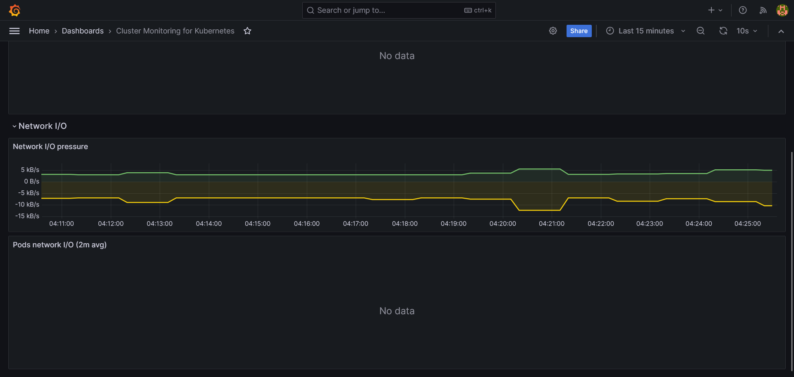
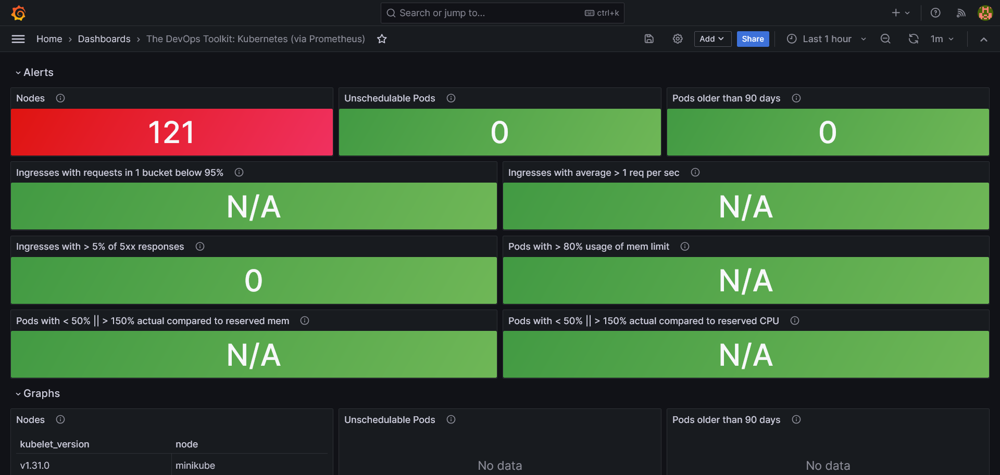

---

### **5. Final Testing and Verification**

1. **Run the CI/CD Pipeline**:
    - Trigger the pipeline in Jenkins and observe the logs for each stage.
    - Ensure Docker images are built and pushed to DockerHub.
    - Verify Kubernetes deployments and services are correctly set up.

2. **Access Application and Monitoring Tools**:
    - Visit your application at the LoadBalancer's external IP.
    - Check Prometheus at `http://<EC2_PUBLIC_IP>:9090`.
    - Review your Grafana dashboards to ensure metrics are being collected and displayed.

---


### Conclusion
Your CI/CD pipeline is now set up! This configuration allows you to automate your deployment process using Jenkins and Docker, monitor your applications with Prometheus, and visualize performance with Grafana.

Make sure to test your setup thoroughly and modify the configurations as needed to suit your application requirements.

---


